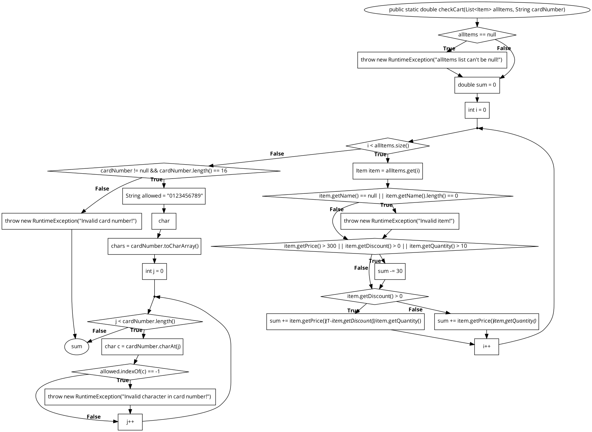

# Втора лабораториска вежба по Софтверско инженерство
***
## Давид Јончески, бр. на индекс 233241
****
### Група на код:

### Control Flow Graph

### Цикломатска комплексност
Цикломатската комплексност на овој код е 8, истата ја добив преку формулата V(G) = P + 1, каде што P е бројот на предикатни јазли.Во случајoв P=8, , па цикломатската комплексност изнесува 9.

### Тест случаи според критериумот Every Statement
```java
 public void testEvery() {
    // allItems е null
    RuntimeException ex1 = assertThrows(RuntimeException.class, () ->
            SILab2.checkCart(null, "1234567890123456"));
    assertEquals("allItems list can't be null!", ex1.getMessage());

    // Item со празно име
    RuntimeException ex2 = assertThrows(RuntimeException.class, () ->
            SILab2.checkCart(List.of(new Item("", 1, 100, 0)), "1234567890123456"));
    assertEquals("Invalid item!", ex2.getMessage());

    //  Valid item, без попуст, без -30
    assertEquals(200, SILab2.checkCart(
            List.of(new Item("Item1", 2, 100, 0)),
            "1234567890123456"
    ), 0.01);

    // Item со цена > 300, -30 треба да се одземе
    assertEquals(470, SILab2.checkCart(
            List.of(new Item("Item2", 1, 500, 0)),
            "1234567890123456"
    ), 0.01);

    // Item со попуст > 0, пресметка со попуст
    assertEquals(360, SILab2.checkCart(
            List.of(new Item("Item3", 2, 200, 0.1)),
            "1234567890123456"
    ), 0.01);

    // Картичка со невалиден карактер
    RuntimeException ex3 = assertThrows(RuntimeException.class, () ->
            SILab2.checkCart(List.of(new Item("Item", 1, 100, 0)), "1234abcd90123456"));
    assertEquals("Invalid character in card number!", ex3.getMessage());

    // Картичка со помалку од 16 chars
    RuntimeException ex4 = assertThrows(RuntimeException.class, () ->
            SILab2.checkCart(List.of(new Item("Item", 1, 100, 0)), "1234"));
    assertEquals("Invalid card number!", ex4.getMessage());
}
```
### Тест случаи според критериумот Multiple Condition
```java
  public void testMultiple() {
    //F F F → false → не се одзема -30
    assertEquals(100, SILab2.checkCart(
            List.of(new Item("Item", 1, 100, 0)),
            "1234567890123456"
    ), 0.01);

    //T F F → true → се одзема -30
    assertEquals(470, SILab2.checkCart(
            List.of(new Item("Item", 1, 500, 0)),
            "1234567890123456"
    ), 0.01);

    //F T F → true → се одзема -30
    assertEquals(330, SILab2.checkCart(
            List.of(new Item("Item", 1, 200, 0.1)),
            "1234567890123456"
    ), 0.01); // 200 -30 + (200*0.9) = 330

    //F F T → true → се одзема -30
    assertEquals(970, SILab2.checkCart(
            List.of(new Item("Item", 11, 100, 0)),
            "1234567890123456"
    ), 0.01); // 1100 - 30 = 1070
}
```

### Објаснување на напишаните unit tests

#### Тест случаи според критериумот Every Statement

1. **Провера за `null` листа со Items**  
   Очекувано: `RuntimeException` со порака `"allItems list can't be null!"`

2. **Провера за Item со празно име**  
   Очекувано: `RuntimeException` со порака `"Invalid item!"`

3. **Item без попуст и без -30 одбивка**  
   Влез: `quantity = 2`, `price = 100`, `discount = 0`  
   Очекуван резултат: `200`

4. **Item со цена > 300 → се одзема -30**  
   Влез: `quantity = 1`, `price = 500`, `discount = 0`  
   Очекуван резултат: `470`

5. **Item со попуст > 0 → попуст и -30 одбивка**  
   Влез: `quantity = 2`, `price = 200`, `discount = 0.1`  
   Пресметка: `200 * 0.9 * 2 = 360`  
   Очекуван резултат: `360`

6. **Невалидна картичка со букви**  
   Влез: `cardNumber = "1234abcd90123456"`  
   Очекувано: `RuntimeException` со порака `"Invalid character in card number!"`

7. **Картичка со помалку од 16 цифри**  
   Влез: `cardNumber = "1234"`  
   Очекувано: `RuntimeException` со порака `"Invalid card number!"`

Минимален број на тест случаи: 7

---

#### Тест случаи според критериумот Multiple Condition
Услов: `if (item.getPrice() > 300 || item.getDiscount() > 0 || item.getQuantity() > 10)`

Минимално тест случаи: 4

| Price > 300 | Discount > 0 | Quantity > 10 | Резултат |
|-------------|---------------|----------------|----------|
| False       | False         | False          | false    |
| True        | False         | False          | true     |
| False       | True          | False          | true     |
| False       | False         | True           | true     |